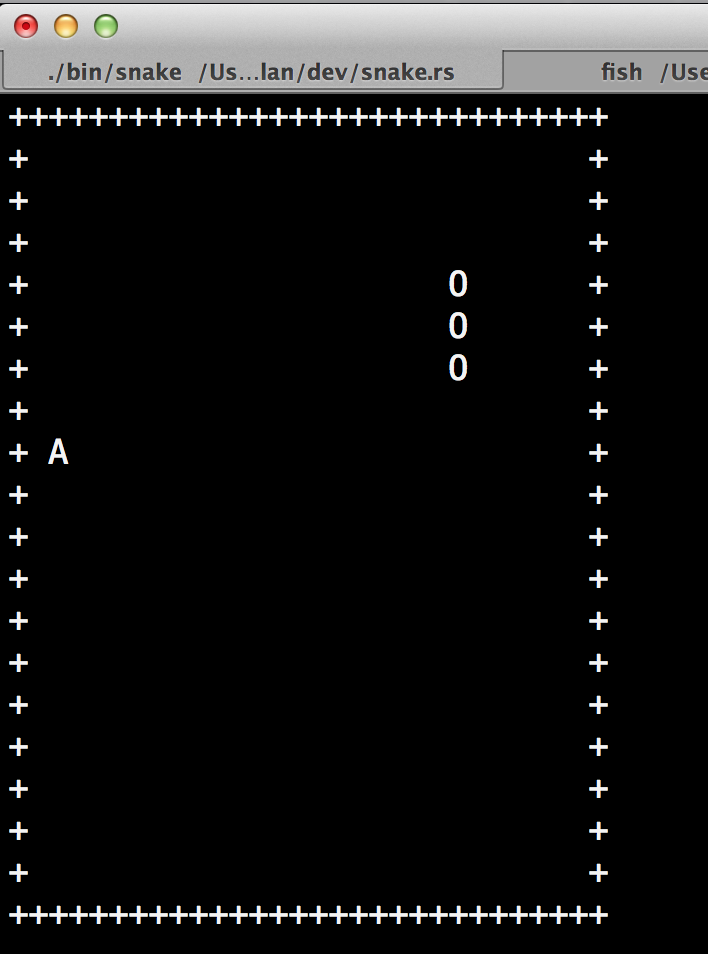

# Snake.rs

This is the tipical snake game implemented in Rust.



# Play !

First [fork](https://github.com/alan-andrade/snake.rs/fork) this repo.

```bash
git clone {your fork}
cd snake.rs
git clone --recursive https://github.com/alan-andrade/snake.rs.git
make
./bin/snake
```
